# =========================================
# SEGMENTOS 1-2: ARQUITECTURAS DE SOFTWARE Y MEMORIA
# =========================================

## Arquitectura Monolítica
- Todo el código fuente vive en un solo proyecto/lenguaje; se compila a un único ejecutable (Artifact/.exe).
- Corre en un servidor que consume Compute (CPU + RAM).
- Desventajas: difícil de escalar (si no se diseñó para múltiples servidores) y actualizar (hay que bajar todo el servidor).

## Arquitectura de Microservicios
- Cada funcionalidad se separa en un módulo/servicio independiente, cada uno en su propio contenedor.
- Principio de responsabilidad única llevado al nivel de servicio.
- Ventajas: cada servicio puede usar un lenguaje distinto (Java, Python, Rust...), escalado agregando contenedores, actualización por versión (v1 -> v2) sin tumbar todo el sistema.
- Da origen a las **Apps Cloud Native**: escalables y elásticas.
- La comunicación entre módulos se da mediante **APIs** (interfaz pública expuesta de un objeto/servicio).
  * REST (la más común, basada en HTTP y verbos GET/POST/PUT/DELETE)
  * SOAP (XML estricto, típico en banca/empresarial)
  * GraphQL (el cliente pide exactamente los campos que necesita, evita sobrecarga)


## Ejecución de un programa (RAM y CPU = "Compute")
- Código fuente en HDD/SSD (persistente) -> se carga a RAM (volátil) -> CPU ejecuta.
- El disco NO participa en la ejecución en sí, solo almacena.
- Ciclo de instrucción del CPU: **Fetch** (traer instrucción) -> **Decode** (decodificar) -> **Execute** (ejecutar).
- La **ALU** ejecuta operaciones aritmético-lógicas y guarda resultado en Registros.

## Arquitecturas de CPU
| Arquitectura | Potencia | Consumo |
|---|---|---|
| x86-64 (Intel/AMD) | Mayor | Mayor |
| ARM (abierta, multi-fabricante) | Menor | Menor |
- ARM domina en móviles por eficiencia energética; en la nube, migrar de x86 a ARM reduce costos.
- El tamaño de `int` depende de la arquitectura (ej. 4 bytes en x86-64 típico vs variaciones en ARM); esto afecta la portabilidad de binarios compilados.


## Memoria y direcciones
- 1 byte = mínimo direccionable; direcciones en hexadecimal (0x0000...).
- Espacio de direcciones de un programa (de low a high address):
  1. **.text (segmento código):** instrucciones, Read-Only.
  2. **.data:** variables globales/estáticas YA inicializadas.
  3. **.bss:** variables globales/estáticas SIN inicializar.
  4. **Heap:** memoria dinámica (`new`/`malloc` en C/C++; automática en Python/Java). Crece hacia arriba. Mal manejo -> Memory Leak / Out of Memory.
  5. **Stack:** variables locales y retornos de función. Crece hacia direcciones bajas (al revés).
  6. Argumentos de línea de comandos y variables de entorno (high address).
- El compilador genera una **tabla de símbolos** (nombre, tipo, alcance de cada variable).
- Punteros: `x` (variable puntero) vive en el stack; el valor que contiene es una dirección; `*x` desreferencia (da el valor apuntado); `&x` da la dirección donde vive `x`.


## Compilación (C/C++, Java)
- Código fuente -> compilador -> `.obj` (lenguaje máquina según arquitectura, NO portable entre x86/ARM).
- **Linker:** mezcla el `.obj` propio con bibliotecas precompiladas -> genera el `.exe`.
- **Debug** = mismo proceso + flag que hace que el CPU ejecute línea por línea.
- Java es un caso especial: el `.obj`/`.class` es **bytecode**, corre sobre la JVM -> por eso Java sí es portable entre arquitecturas.

> [Resumen Completo](https://github.com/AxelAbarMe/Estructuras-Datos/blob/main/General/Teoria/Clase_1-2_Apuntes.md) - Arquitectura, Memory Segment, Monolítico vs Microservicios, Compiler vs Interpreter

# =========================================
# SEGMENTO 3: LENGUAJES INTERPRETADOS, GIT, METODOLOGÍAS
# =========================================

## Lenguajes interpretados (Python, JavaScript)
- Un intérprete (VM Runtime) lee una instrucción, genera Bytecode para esa instrucción según arquitectura, la manda a RAM/CPU, y repite con la siguiente.
- Más lento que compilado (repite el proceso instrucción por instrucción) pero más portable (mismo código corre en distintas arquitecturas) y más simple de programar/depurar.
- **JIT (Just-In-Time):** híbrido que compila bytecode a nativo en tiempo de ejecución (JVM, motor V8 de JS) buscando rendimiento cercano al compilado sin perder portabilidad.

## Git — Control de versiones
- **Commit:** snapshot del estado de archivos en un momento dado; Git solo guarda cambios (delta), no copias completas.
- **Push / Pull (Fetch+Merge) / Merge (Merge o Rebase).**
- **Rebase:** reescribe el historial en línea recta (más limpio). **Merge:** conserva las ramas y crea un commit de unión.
- **Branches:** permiten trabajar en paralelo sin afectar main/master hasta que el código esté probado.
- **CI/CD:** automatiza pruebas (QA), construcción de contenedores y despliegue; se apoya en Cloud Computing.
- **Unit Testing:** funciones que verifican una unidad de código.

Comandos clave: `git init`, `git clone <url>`, `git add`, `git commit -m`, `git status`, `git switch -c` / `git checkout -b` (crear rama), `git branch`, `git diff`, `git restore`, `git reset --hard`, `git stash`, `git rebase -i`, `git log --oneline`, `git blame`, `git cherry-pick`, `git remote add`, `git push -u origin <rama>`, `git pull --rebase`.

## Metodologías de desarrollo
- **Spec-Driven Development:** primero se escribe una especificación clara (comportamiento, entradas, salidas, restricciones) que se vuelve fuente de verdad; el punto de partida es la *intención*. Muy relevante para desarrollo asistido por IA.
- **Test-Driven Development (TDD):** las pruebas se escriben ANTES del código. Ciclo **Red-Green-Refactor**:
  1. Red: se escribe una prueba que falla porque el código no existe.
  2. Green: se escribe el código mínimo para pasarla.
  3. Refactor: se limpia el código manteniendo las pruebas en verde.
- Diferencia clave: TDD parte de una prueba ejecutable; Spec-Driven parte de una especificación en lenguaje natural/semi-formal.

## Debugger
- Breakpoints, **Run** (directo) vs **Debug** (flag paso a paso).
- **Step Over (F10):** no entra a la función llamada. **Step Into (F11):** entra a la función.
- **Call Stack:** muestra las llamadas activas. **Variables:** muestra `.data`/`.bss`. **Watch:** expresiones en tiempo real.

> [Resumen Completo](https://github.com/AxelAbarMe/Estructuras-Datos/blob/main/General/Teoria/Clase_3_Apuntes.md) - Compiler vs Interpreter, Git, Debugger

# =========================================
# SEGMENTO 4: ARCHIVOS
# =========================================

## Texto vs Binario
- **Texto:** secuencia de caracteres legibles, cada carácter se representa según una codificación.
- **Binario:** representación directa en formato máquina (bits), no legible directamente.
- Los binarios generalmente ocupan MENOS espacio y son más rápidos de leer/escribir (no requieren traducción carácter por carácter).

## Codificación de caracteres
- **ASCII:** 7 bits (128 caracteres) originalmente, extendido a 8 bits (256). Ej: 'A'=65=01000001.
- **Unicode:** hasta ~240,000 caracteres, soporta múltiples idiomas/alfabetos.
- **UTF-8:** codificación de Unicode más usada; compatible hacia atrás con ASCII (1 byte para los primeros 128 caracteres). También existen UTF-16 y UTF-32.
- Emisor y receptor deben usar el MISMO mecanismo de codificación o se corrompen los caracteres.

## Rendimiento de archivos
- Disco (HDD/SSD) -> RAM -> CPU (el CPU solo se comunica con RAM, nunca directo con disco).
- Cargar un archivo a memoria es costoso en tiempo.
- Jerarquía: CPU (rápido, poco espacio) > RAM > HDD (lento, mucho espacio).
- **Caché:** guarda información cercana al CPU para evitar viajes a RAM/disco repetidos (clave para *High Performance*).
- Leer/escribir en bloques (o toda la info de una vez) es más eficiente que hacerlo byte por byte (menos operaciones de I/O).
- Comparativa real (1,000,000 registros): el archivo binario pesa menos y se lee/escribe más rápido que el equivalente en texto.

## Modos de apertura en Python (`open()`)
- `'r'`/`'r+'`: lectura (y escritura); falla si no existe.
- `'w'`/`'w+'`: escritura, trunca o crea el archivo.
- `'a'`/`'a+'`: agrega al final, crea si no existe.
- Sufijo `'b'` (`'rb'`, `'wb'`, `'ab'`): modo binario.

```python
with open("datos.txt", "r") as f:
    contenido = f.read()
```

## Serialización
- Convertir datos de memoria (RAM) a un formato guardable en disco (y viceversa).
- **pickle** en Python: `pickle.dump()` serializa, `pickle.load()` deserializa.
- Los binarios se leen sabiendo cuántos bytes leer (no caracteres).

## Formatos de archivo estructurados
- **XML:** por etiquetas (`<tag>valor</tag>`); común en sistemas empresariales/SOAP.
- **JSON:** por llaves `{ "clave": valor }`; el más usado en APIs REST por ser ligero.
- **YAML:** por indentación `clave: valor`; muy usado en archivos de configuración (Docker Compose, CI/CD) por legibilidad humana.

```
XML
<user>
  <id>1</id>
  <name>John Doe</name>
  <email>john.doe@example.com</email>
  <is_active>true</is_active>
  <roles>
    <role>admin</role>
    <role>editor</role>
  </roles>
</user>

JSON
{
  "id": 1,
  "name": "John Doe",
  "email": "john.doe@example.com",
  "is_active": true,
  "roles": ["admin", "editor"]
}

YAML
id: 1
name: John Doe
email: john.doe@example.com
is_active: true
roles:
  - admin
  - editor
```

> [Resumen Completo](https://github.com/AxelAbarMe/Estructuras-Datos/blob/main/General/Teoria/Clase_4_Apuntes.md) - Archivos (.txt | .bin | .json | .xml | .yaml)

# =========================================
# SEGMENTO 5: TDA — TIPOS DE DATOS ABSTRACTOS (LINEALES)
# =========================================

## Concepto de TDA
- Un TDA se define por los **datos** que guarda y las **operaciones** que permite (no por su implementación interna, que puede variar).
- Permite elegir la estructura más eficiente según el problema.

## Vector (Arreglo)
- Memoria **contigua**; se debe conocer/reservar el tamaño de antemano.
- `v[i]` se traduce internamente en `*(v + i*sizeof(tipo))` -> **Acceso Directo, O(1)**.
- **Vector estático** (tamaño fijo, ej. `int v[5]` en C++) vs **Vector dinámico** (`realloc`, requiere buscar nuevo espacio, copiar todo -> **Deep Copy**, liberar el anterior).
- Redimensionar 1 en 1 es ineficiente (para n inserciones, ~O(n²) operaciones acumuladas vía suma de Gauss); la solución estándar es la **expansión x2** (duplicar capacidad), que reduce drásticamente el número total de copias (amortiza a O(1) por inserción en promedio).
- Operaciones: Insertar, Borrar, Buscar.

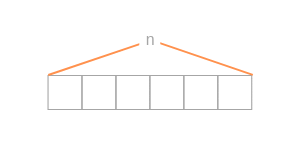

## Lista Enlazada Simple
- Cada **Nodo** guarda un dato y un puntero `next` al siguiente nodo; no requiere memoria contigua.
```python
class Nodo:
    def __init__(self, dato=None, next=None):
        self.dato = dato
        self.next = next
```
- Operaciones: Insertar, Borrar, Buscar (recorrido secuencial, O(n) para buscar).

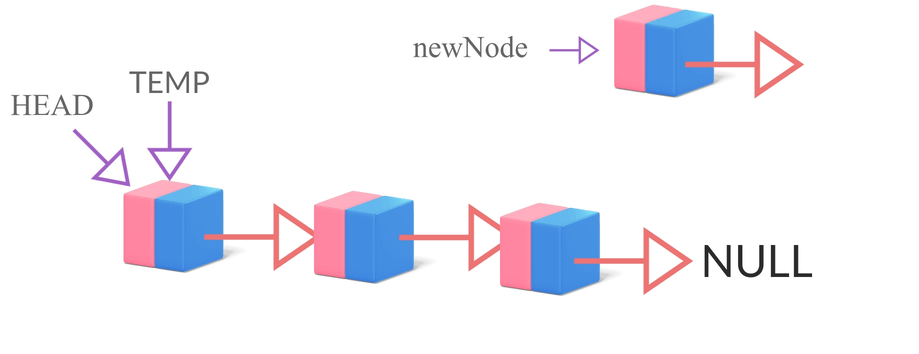

## Cola (Queue) — FIFO
- **First In, First Out.**
- `enqueue()`: inserta por *tail/rear*. `dequeue()`: extrae por *head/front*.
- Con referencia directa a front y rear: ambas operaciones son **O(1)**; si solo se tiene *front*, insertar al final degrada a O(n).
- Usos: colas de impresión, procesos del SO, peticiones de servidor, BFS en árboles/grafos.

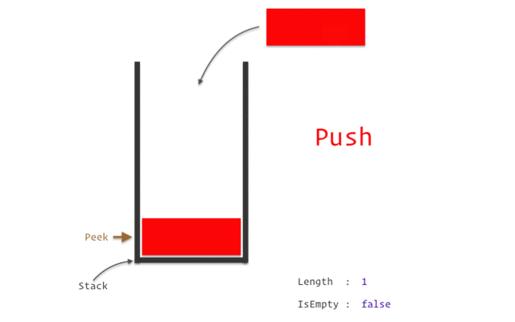

## Pila (Stack) — LIFO
- **Last In, First Out.**
- `push()`: inserta en el tope. `pop()`: extrae y elimina el tope. `top()`/`peek()`: consulta el tope sin eliminar.
- Todas las operaciones son **O(1)** (solo se manipula un extremo).
- Usos: Undo de editores, historial "atrás" del navegador, balanceo de paréntesis, **stack de llamadas del CPU** (base de la recursión). Un exceso de `push` sin `pop` -> **Stack Overflow**.

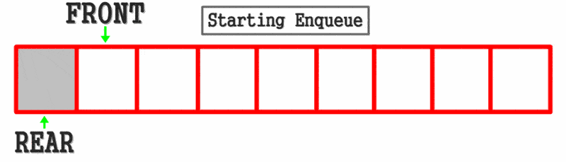

> Vector, Lista Enlazada, Cola y Pila son estructuras **lineales**. Existen también estructuras **no lineales** (árboles, grafos, tablas hash) donde los elementos se relacionan jerárquica o reticularmente, no de forma secuencial.

> [Resumen Completo](https://github.com/AxelAbarMe/Estructuras-Datos/blob/main/General/Teoria/Clase_5_Apuntes.md) - TDA Simple (Lista enlazada simple, vector, stack, queue)

# =========================================
# SEGMENTO 6: LISTAS DOBLEMENTE ENLAZADAS, COLAS Y PILAS (IMPLEMENTACIÓN)
# =========================================

## Lista Doblemente Enlazada
- Cada nodo tiene `prev`, `data` y `next` -> permite recorrer la lista en ambas direcciones (una lista simple solo avanza y obligaría a reiniciar desde el head para "retroceder").
- Ejemplo típico de uso: un carrusel de imágenes (`< [ ] >`).
```python
class DoubleNode:
    def __init__(self, value):
        self.value = value
        self.next = None
        self.prev = None
```
- **Overhead:** memoria extra necesaria por la estructura misma (los punteros `prev`/`next`), no por los datos útiles. A mayor cantidad de nodos, mayor el costo acumulado de overhead; relevante en hardware con RAM limitada.


## Cola implementada con lista simple
- Usar una lista doblemente enlazada para una cola desperdicia memoria (overhead innecesario), porque una cola nunca retrocede manualmente; basta una lista simple con referencias a `front` y `rear`.
```python
class Queue:
    def __init__(self):
        self.front = None
        self.rear = None
    def enqueue(self, value):
        nuevo = Nodo(value)
        if self.rear is None:
            self.front = self.rear = nuevo
            return
        self.rear.next = nuevo
        self.rear = nuevo
```

## Pila implementada con lista simple
```python
class Stack:
    def __init__(self):
        self.top = None
    def push(self, value):
        n = Nodo(value)
        n.next = self.top
        self.top = n
    def pop(self):
        if self.top is None:
            return None
        v = self.top.value
        self.top = self.top.next
        return v
```
- Colas y pilas se pueden implementar con vector o con lista enlazada; lo importante es saber **cuándo usar cada TDA**, no memorizar la implementación (en Python existen `queue.Queue`, `queue.LifoQueue`, y sobre todo `collections.deque`, la opción recomendada para ambas por su eficiencia al insertar/eliminar en los extremos).

> [Resumen Completo](https://github.com/AxelAbarMe/Estructuras-Datos/blob/main/General/Teoria/Clase_6_Apuntes.md) - Lista doblemente enlazada, stack, queue

# =========================================
# SEGMENTO 7: RECURSIÓN
# =========================================

## Definición
- Una función que se llama a sí misma. Requiere:
  1. **Caso base** (detiene la recursión).
  2. **Caso recursivo / repetición** (avanza hacia el caso base).
- Sin caso base -> recursión infinita -> **Stack Overflow**.

### Ejemplo de código

```python
def cuenta(n):       # 0x4000
  if n==0:           # 0x4004   }  Caso
    return           # 0x4008   }  Base
  cuenta(n-1)        # 0x400C   } -v
  print(n)           # 0x4010   }  Repetición

def main():          # 0x4100
  x=5                # 0x4104
  cuenta(x)          # 0x4108

main()               # 0x4120
```

## Registros del CPU relevantes
- **RIP (Instruction Pointer):** dirección de la siguiente instrucción a ejecutar.
- **RSP (Stack Pointer):** dirección del tope actual de la pila del sistema.
- Cada llamada crea un **Stack Frame** (guarda parámetros, variables locales y dirección de retorno `RET`).
- Cada llamada = `push` al stack; cada `return` = `pop` del stack (regresa a la dirección `RET` guardada).
- Variables locales con el mismo nombre en distintas llamadas NO se pisan entre sí: cada una vive en su propio stack frame.

| Stack Frames | Stack |
|:---:|:--:|
| Stack Frame | `cuenta()` - RET->0x400C - n=0 |
| Stack Frame | `cuenta()` - RET->0x400C - n=1 |
| Stack Frame | `cuenta()` - RET->0x400C - n=2 |
| Stack Frame | `cuenta()` - RET->0x400C - n=3 |
| Stack Frame | `cuenta()` - RET->0x400C - n=4 |
| Stack Frame | `cuenta()` - RET->0x4108 - n=5 |
| Stack Frame | `main()` - RET->0x4120 - X=5 |

> **Nota:** aunque en el stack frame donde se guarda `cuenta()` la variable local se llamara `n` en vez de `x`, esto no afecta a la variable guardada en `main()`, debido a que están en stack frames diferentes.

## Backtracking
- Técnica donde, ante un "punto muerto" (dead point), el algoritmo recursivo puede devolverse (pop) y probar otro camino. Ejemplo clásico: resolver un laberinto.

## Recursión vs. Iteración
- En general la versión iterativa rinde mejor (menos overhead de stack frames); se prefiere recursión solo cuando el problema es naturalmente recursivo o muy difícil de plantear iterativamente.

## Recursión de cola (Tail Recursion)
- Ocurre cuando la llamada recursiva es la última instrucción de la función, sin operaciones pendientes después.
- Los compiladores pueden aplicar **TCO (Tail Call Optimization)** y reutilizar el mismo stack frame (equivalente a un ciclo).
- **Python NO implementa TCO**: cada llamada recursiva de cola sigue consumiendo un stack frame nuevo -> puede producir `RecursionError`.

## Divide y Vencerás (ejemplos clásicos)
```python
def sumatoria(n):
    if n == 0:
        return 0
    return n + sumatoria(n-1)

def factorial(n):
    if n <= 1:
        return 1
    return n * factorial(n-1)
```
- Cada llamada apila un stack frame con su `RET` pendiente; los resultados se resuelven "de abajo hacia arriba" conforme se hace `pop` de cada frame.

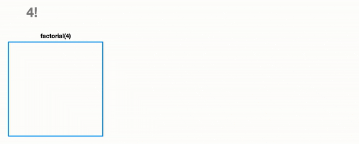

> [Resumen Completo](https://github.com/AxelAbarMe/Estructuras-Datos/blob/main/General/Teoria/Clase_7_Apuntes.md) - Recursividad

# =========================================
# SEGMENTO 8: EFICIENCIA (COMPLEJIDAD ALGORÍTMICA)
# =========================================

## Aspectos de la eficiencia
- **Tiempo (CPU):** se mide en cantidad de instrucciones ejecutadas, NO en segundos reales (el hardware varía).
- **Espacio (RAM):** memoria adicional que consume el algoritmo.
- Mejorar tiempo puede implicar sacrificar espacio (y viceversa) -> **trade-off tiempo/espacio**. Ejemplo: **memoización** (guardar resultados ya calculados en una estructura auxiliar, ej. Fibonacci pasa de O(2ⁿ) a O(n) a cambio de más memoria).


## Cotas
- **Cota superior (Big-O, "O"):** peor caso; la más usada en la práctica.
- **Cota inferior (Big-Omega, "Ω"):** mejor caso.
- **Cota ajustada (Big-Theta, "Θ"):** cuando el mejor y peor caso coinciden.

## Simplificación de Big-O
- Se suman las complejidades de cada bloque, se elimina todo lo que no sea el término dominante y se eliminan las constantes multiplicativas.
  * Ej: O(2n) + O(4) -> se descarta O(4) (constante) -> O(2n) -> se elimina el 2 -> **O(n)**.

## Tipos de complejidad más comunes (de mejor a peor)
| Complejidad | Nombre | Ejemplo típico |
|---|---|---|
| O(1) | Constante | Acceso directo a un vector |
| O(log n) | Logarítmica | Búsqueda binaria, árbol binario |
| O(n) | Lineal | Recorrer lista enlazada |
| O(n log n) | Lineal-Logarítmica | Mergesort, Heapsort, Quicksort (promedio) |
| O(n²) | Cuadrática | Ciclos anidados, Bubble/Selection Sort |
| O(2ⁿ) | Exponencial | Fibonacci recursivo sin memoización |
| O(n!) | Factorial | Fuerza bruta de permutaciones (vendedor viajero) |

## Tabla de crecimiento (aprox. de instrucciones)
| n | O(1) | O(log n) | O(n) | O(n log n) | O(n²) |
|---|---|---|---|---|---|
| 10 | 1 | ~3 | 10 | ~33 | 100 |
| 100 | 1 | ~7 | 100 | ~664 | 10,000 |
| 1,000 | 1 | ~10 | 1,000 | ~9,966 | 1,000,000 |

- Esto justifica por qué se prefiere O(1) del vector sobre O(n) de una lista enlazada para acceso por posición, y por qué se evitan ciclos anidados sobre grandes volúmenes de datos.

> [Resumen Completo](https://github.com/AxelAbarMe/Estructuras-Datos/blob/main/General/Teoria/Clase_8_Apuntes.md) - Eficiencia y O Grande

# =========================================
# SEGMENTO 9: HEAPS Y COLAS DE PRIORIDAD
# =========================================

## Heap (Binary Heap)
- Árbol binario **completo** (se llenan los hijos de izquierda a derecha, nivel por nivel, sin huecos).
- No es lo mismo que un BST: solo garantiza la relación padre-hijo, no un orden entre hermanos.
- **Heap Máximo:** el padre siempre es mayor que sus hijos.
- **Heap Mínimo:** el padre siempre es menor que sus hijos.

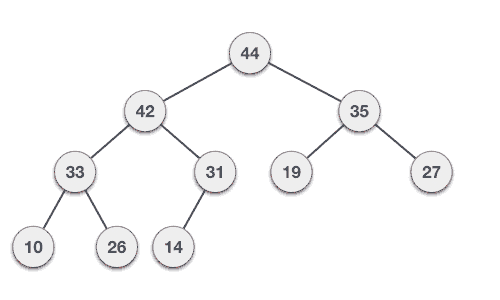

## Representación como vector
Dado un nodo en la posición `i`:
- Raíz: posición 0.
- Padre: `(i-1) // 2`
- Hijo izquierdo: `(i*2) + 1`
- Hijo derecho: `(i*2) + 2`

## Operaciones y complejidad
- Obtener el máximo (heap máx) o mínimo (heap mín): **O(1)** (siempre está en la raíz), vs **O(n)** en una lista enlazada sin ordenar.
- **Insertar:** se agrega al final del vector y se aplica **Bubble Up** (sube intercambiando con su padre mientras lo supere) -> **O(log n)** (proporcional a la altura del árbol).
- **Heapify:** convierte un vector arbitrario en un heap válido, recorriendo desde el último nodo no-hoja hacia la raíz aplicando bubble-down cuando corresponde -> **O(n)** total.

```python
def bubble_up(heap, i):
    padre = (i - 1) // 2
    if i > 0 and heap[i] > heap[padre]:
        heap[i], heap[padre] = heap[padre], heap[i]
        bubble_up(heap, padre)
```


## Cola de Prioridad
- TDA con operaciones **insertar** y **pop/dequeue**, que siempre devuelve el elemento de mayor (o menor) prioridad.
- Se puede implementar con Heap (O(log n) por operación) o con lista enlazada (O(n)); el Heap es la opción eficiente.
- Aplicaciones reales: algoritmo de **Dijkstra** (camino más corto), compresión de **Huffman**, `heapq` en Python y `PriorityQueue` en Java (ambos basados en Heap Mínimo).


> [Resumen Completo](https://github.com/AxelAbarMe/Estructuras-Datos/blob/main/General/Teoria/Clase_9_Apuntes.md) - Heap y Cola de prioridad

# =========================================
# SEGMENTO 10: ALGORITMOS DE ORDENAMIENTO
# =========================================

## Conceptos previos
- **Complejidad temporal:** mejor, promedio y peor caso, medida en comparaciones/intercambios.
- **Complejidad espacial:** memoria extra requerida.
  * **In-place:** O(1) memoria extra.
  * **Out-of-place:** memoria proporcional a n (O(n) o más).
- **Estabilidad:** conserva el orden relativo de elementos iguales.
- **Adaptabilidad:** mejora su rendimiento si la entrada ya está parcial/totalmente ordenada.

## Tabla comparativa (complejidades)
| Algoritmo | Mejor | Promedio | Peor | Espacio | Estable | Adaptativo |
|---|---|---|---|---|---|---|
| Burbuja | O(n) | O(n²) | O(n²) | O(1) | Sí | Sí |
| Selección | O(n²) | O(n²) | O(n²) | O(1) | No | No |
| Inserción | O(n) | O(n²) | O(n²) | O(1) | Sí | Sí |
| Quicksort | O(n log n) | O(n log n) | O(n²) | O(log n) | No | No |
| Mergesort | O(n log n) | O(n log n) | O(n log n) | O(n) | Sí | No |
| Heapsort | O(n log n) | O(n log n) | O(n log n) | O(1) | No | No |
| Counting Sort | O(n+k) | O(n+k) | O(n+k) | O(n+k) | Sí | No |
| Radix Sort | O(nk) | O(nk) | O(nk) | O(n+k) | Sí | No |

## Ordenamiento Burbuja (Bubble Sort)
- Compara pares **adyacentes** e intercambia si están desordenados; en cada pasada "burbujea" el mayor hacia el final.
- Optimización con bandera de "sin intercambios" -> permite terminar en O(n) si ya está ordenado (adaptativo).
```python
def bubble_sort(arr):
    n = len(arr)
    for i in range(n - 1):
        cambio = False
        for j in range(n - 1 - i):
            if arr[j] > arr[j+1]:
                arr[j], arr[j+1] = arr[j+1], arr[j]
                cambio = True
        if not cambio:
            break
    return arr
```

## Representación gráfica

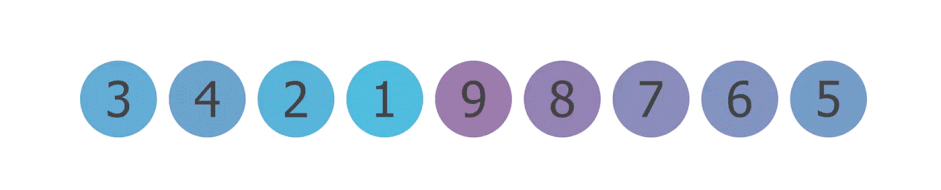

## Ordenamiento por Selección (Selection Sort)
- Busca el mínimo de la porción desordenada y lo intercambia con la primera posición desordenada.
- Siempre recorre todo, por eso no es adaptativo; máximo 1 intercambio por pasada.
```python
def selection_sort(arr):
    n = len(arr)
    for i in range(n - 1):
        m = i
        for j in range(i + 1, n):
            if arr[j] < arr[m]:
                m = j
        arr[i], arr[m] = arr[m], arr[i]
    return arr
```

## Representación gráfica

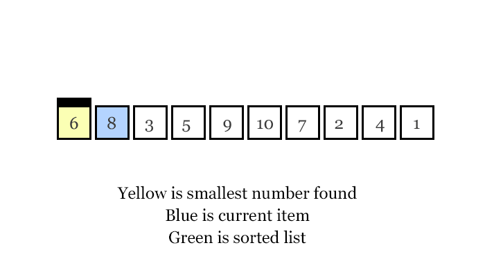

## Ordenamiento por Inserción (Insertion Sort)
- Inserta cada elemento en su posición correcta dentro de la parte ya ordenada (como ordenar cartas en la mano).
- Muy eficiente en arreglos pequeños o casi ordenados; usado por Timsort (Python) en sub-arreglos pequeños.
```python
def insertion_sort(arr):
    for i in range(1, len(arr)):
        actual = arr[i]
        j = i - 1
        while j >= 0 and arr[j] > actual:
            arr[j+1] = arr[j]
            j -= 1
        arr[j+1] = actual
    return arr
```

## Representación gráfica


## Quicksort
- Divide y vencerás: elige un **pivote**, particiona en menores/mayores, y ordena recursivamente cada partición.
- Elección del pivote crítica: primer/último elemento en arreglo ya ordenado -> peor caso O(n²).
- **Dos formas comunes de elegir el pivote:**
  * Usar la **mediana** (buen balance, pero agrega O(n) adicional al cálculo).
  * Usar un **elemento aleatorio (random)**, que en la práctica rinde de forma similar a la mediana y evita el peor caso con alta probabilidad.
- No estable; espacio O(log n) por la pila de recursión; muy rápido en la práctica por buen uso de caché.
```python
def quicksort(arr):
    if len(arr) <= 1:
        return arr
    pivote = arr[len(arr) // 2]
    menores = [x for x in arr if x < pivote]
    iguales = [x for x in arr if x == pivote]
    mayores = [x for x in arr if x > pivote]
    return quicksort(menores) + iguales + quicksort(mayores)
```

## Representación gráfica

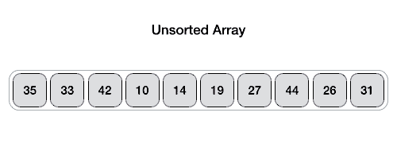


## Mergesort
- Divide y vencerás: divide a la mitad hasta llegar a elementos individuales, luego mezcla (**merge**) manteniendo el orden.
- Garantiza O(n log n) en todos los casos (no adaptativo); requiere O(n) de espacio extra (no in-place); estable si se elige primero el elemento izquierdo en empates.
- Preferido cuando se necesita estabilidad garantizada o se ordenan listas enlazadas/datos externos.
```python
def merge(izq, der):
    r = []
    i = j = 0
    while i < len(izq) and j < len(der):
        if izq[i] <= der[j]:
            r.append(izq[i]); i += 1
        else:
            r.append(der[j]); j += 1
    return r + izq[i:] + der[j:]
```

## Representación gráfica

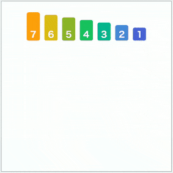

## Heapsort
- Fase 1: **Heapify** del arreglo completo (O(n)).
- Fase 2: extraer repetidamente la raíz (máximo), intercambiarla al final, reducir el heap y aplicar bubble-down -> n extracciones de O(log n) cada una.
- O(n log n) garantizado en todos los casos, espacio O(1) (in-place), pero NO estable. Combina lo mejor de tiempo garantizado y espacio constante (algo que ni Quicksort ni Mergesort logran juntos).

```python
def heapify(arr, n, i):
    mayor = i
    izq = 2 * i + 1
    der = 2 * i + 2

    if izq < n and arr[izq] > arr[mayor]:
        mayor = izq
    if der < n and arr[der] > arr[mayor]:
        mayor = der

    if mayor != i:
        arr[i], arr[mayor] = arr[mayor], arr[i]
        heapify(arr, n, mayor)  # Bubble-down recursivo

def heap_sort(arr):
    n = len(arr)

    # Construir el Heap Máximo (Heapify)
    for i in range(n // 2 - 1, -1, -1):
        heapify(arr, n, i)

    # Extraer elementos uno por uno
    for i in range(n - 1, 0, -1):
        arr[0], arr[i] = arr[i], arr[0]  # Mover raíz al final
        heapify(arr, i, 0)               # Restaurar heap con tamaño reducido

    return arr

print(heap_sort([5, 2, 9, 1, 5, 6]))
```

## Representación gráfica

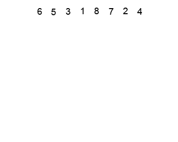

## Counting Sort
- No compara elementos; cuenta ocurrencias de cada valor en un rango conocido `k` y las acumula para ubicar cada elemento en su posición final.
- O(n+k) tiempo y espacio; estable si se recorre de derecha a izquierda al colocar; solo eficiente si `k` es pequeño respecto a `n`.
```python
def counting_sort(arr):
    if not arr: return arr
    mn, mx = min(arr), max(arr)
    conteo = [0]*(mx-mn+1)
    for x in arr:
        conteo[x-mn] += 1
    for i in range(1, len(conteo)):
        conteo[i] += conteo[i-1]
    salida = [0]*len(arr)
    for x in reversed(arr):
        conteo[x-mn] -= 1
        salida[conteo[x-mn]] = x
    return salida
```

## Representación gráfica

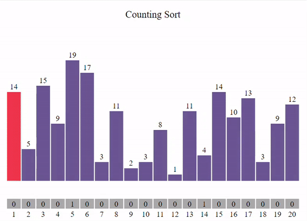

## Radix Sort
- Ordena por dígitos, del menos al más significativo (LSD), usando Counting Sort estable como subrutina en cada pasada.
- O(n·k), donde k = cantidad de dígitos; requiere que la subrutina sea estable para preservar el orden de pasadas anteriores.
- Útil para grandes volúmenes de enteros o cadenas de longitud fija.
```python
def counting_sort_por_digito(arr, exp):
    n = len(arr)
    salida = [0] * n
    conteo = [0] * 10  # Dígitos van de 0 a 9

    for numero in arr:
        digito = (numero // exp) % 10
        conteo[digito] += 1

    for i in range(1, 10):
        conteo[i] += conteo[i - 1]

    for i in range(n - 1, -1, -1):
        digito = (arr[i] // exp) % 10
        conteo[digito] -= 1
        salida[conteo[digito]] = arr[i]

    return salida

def radix_sort(arr):
    if not arr:
        return arr
    
    maximo = max(arr)
    exp = 1
    while maximo // exp > 0:
        arr = counting_sort_por_digito(arr, exp)
        exp *= 10
    
    return arr

print(radix_sort([170, 45, 75, 90, 802, 24, 2, 66]))
```
## Representación gráfica


## ¿Cuándo usar cuál? (resumen rápido)
- **Burbuja/Selección/Inserción:** datasets muy pequeños, fines educativos, o casi ordenados (Burbuja/Inserción, por ser adaptativos). Selección conviene si escribir/intercambiar es costoso.
- **Quicksort:** el más rápido en la práctica; no requiere estabilidad; se mitiga el peor caso con pivote aleatorio.
- **Mergesort:** cuando se necesita O(n log n) garantizado + estabilidad, o listas enlazadas/ordenamiento externo.
- **Heapsort:** cuando se necesita O(n log n) garantizado + espacio O(1) a la vez.
- **Counting/Radix Sort:** enteros en un rango conocido y acotado; superan la barrera teórica O(n log n) de los algoritmos por comparación.


> [Resumen Completo](https://github.com/AxelAbarMe/Estructuras-Datos/blob/main/General/Teoria/Clase_%6011_Apuntes.md) - Algoritmos de Ordenamiento

# =========================================
# 11. Comparativas entre algoritmos de ordenamiento
# =========================================

### Burbuja
- **Comparaciones:** $(n^2 - n) / 2$ en todos los casos (sin optimización) o $n - 1$ en el mejor caso (con bandera de intercambio).
- **Intercambios:** $0$ (Mejor caso), $(n^2 - n) / 2$ (Peor caso).
- **Información clave:** Algoritmo adaptativo si se usa bandera de control. Es ineficiente debido al alto número de intercambios adyacentes en el peor caso.

### Selección
- **Comparaciones:** $(n^2 - n) / 2$ en todos los casos.
- **Intercambios:** $0$ (Mejor caso), $n - 1$ (Peor caso).
- **Información clave:** Es ideal cuando el costo de escritura/intercambio en memoria es muy alto (ej. memorias Flash), ya que realiza como máximo $n - 1$ intercambios. No es adaptativo ni estable.

### Inserción
- **Comparaciones:** $n - 1$ (Mejor caso), $(n^2 - n) / 2$ (Peor caso).
- **Intercambios / Desplazamientos:** $0$ (Mejor caso), $(n^2 - n) / 2$ (Peor caso).
- **Información clave:** Sumamente eficiente para arreglos pequeños o casi ordenados. Sirve de base para algoritmos híbridos como Timsort.

### Quicksort
- **Comparaciones:** $O(n \log n)$ (Mejor y caso promedio), $(n^2 - n) / 2$ (Peor caso).
- **Intercambios:** $O(n \log n)$ en promedio.
- **Información clave:** El rendimiento depende críticamente de la selección del pivote. Utilizar la mediana agrega $O(n)$ adicional por nivel, mientras que seleccionar un elemento aleatorio reduce drásticamente la probabilidad del peor caso manteniendo un rendimiento óptimo en la práctica. In-place respecto a los datos, pero requiere $O(\log n)$ espacio en la pila de llamadas.

### Mergesort
- **Comparaciones:** Entre $\frac{1}{2} n \log_2 n$ y $n \log_2 n - n + 1$.
- **Asignaciones / Copias de memoria:** $O(n \log n)$ debido a los arreglos auxiliares de mezcla.
- **Información clave:** Garantiza siempre $O(n \log n)$ independientemente de la distribución de los datos. No es in-place ($O(n)$ de espacio extra). Ideal para listas enlazadas y ordenamiento externo de archivos masivos.

### Heapsort
- **Comparaciones:** $\approx 2n \log_2 n$ en el peor caso.
- **Intercambios:** $O(n \log n)$ en el proceso de extracción de la raíz.
- **Información clave:** Combina lo mejor del peor caso de Mergesort ($O(n \log n)$ garantizado) con el consumo de memoria de Selección ($O(1)$ espacio extra). No es estable ni adaptativo.

### Counting Sort
- **Comparaciones:** $0$ (Algoritmo no basado en comparaciones).
- **Operaciones totales:** $O(n + k)$, donde $k$ es el rango de los valores ($max - min + 1$).
- **Información clave:** Supera la barrera del $O(n \log n)$, pero requiere $O(n + k)$ espacio adicional. Solo es práctico si el rango $k$ no es significativamente mayor que $n$.

### Radix Sort
- **Comparaciones:** $0$ (Algoritmo no basado en comparaciones).
- **Operaciones totales:** $O(d \cdot (n + k))$, donde $d$ es la cantidad de dígitos/posiciones y $k$ la base numérica (ej. 10 para decimales).
- **Información clave:** Procesa los datos por posiciones (LSD) utilizando Counting Sort como subrutina. Requiere que la subrutina sea estrictamente estable para preservar el orden de las pasadas previas.

---

## Comparaciones e intercambios exactos: Selección vs Inserción
### Selección
- **Comparaciones (siempre las mismas, no depende del orden):** (n² − n) / 2
- **Intercambios:** 0 en el mejor caso (no ocurre realmente, pero teóricamente el mínimo posible) — n−1 en el peor caso (como máximo un intercambio por pasada, y hay n−1 pasadas).

### Inserción
- **Comparaciones — mejor caso:** n − 1 (arreglo ya ordenado, una sola comparación por elemento).
- **Intercambios (desplazamientos) — mejor caso:** 0. **Peor caso:** (n² − n) / 2 (arreglo en orden inverso, cada elemento se desplaza hasta el inicio).

> **Conclusión práctica:** Selección conviene cuando escribir/intercambiar es costoso (ej. limitaciones de escritura en disco), porque en su peor caso solo hace n−1 intercambios, mientras que Inserción puede llegar a (n²−n)/2 intercambios en su peor caso. Selección "paga" ese ahorro con más comparaciones fijas ((n²−n)/2 siempre), mientras que Inserción es más barata en comparaciones cuando los datos ya están casi ordenados.

> **Estrategias de pivote en Quicksort:** El funcionamiento y balanceo de las particiones depende del pivote:
> - *Mediana real:* Garantiza particiones equilibradas pero agrega un costo adicional de $O(n)$ por nivel.
> - *Pivote aleatorio:* Tiene un costo computacional despreciable y logra un rendimiento cercano al caso óptimo en la práctica.

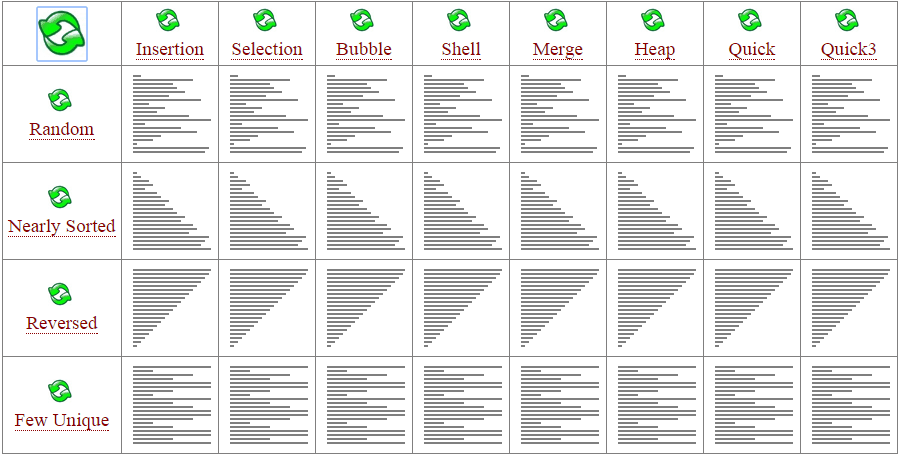

> [Resumen Completo](https://github.com/AxelAbarMe/Estructuras-Datos/blob/main/General/Teoria/Clase_%6012_Apuntes.md) - Comparativa entre algoritmos de ordenamiento
