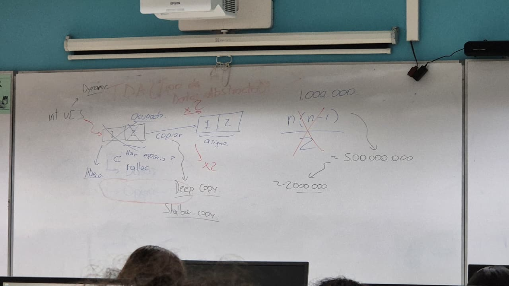
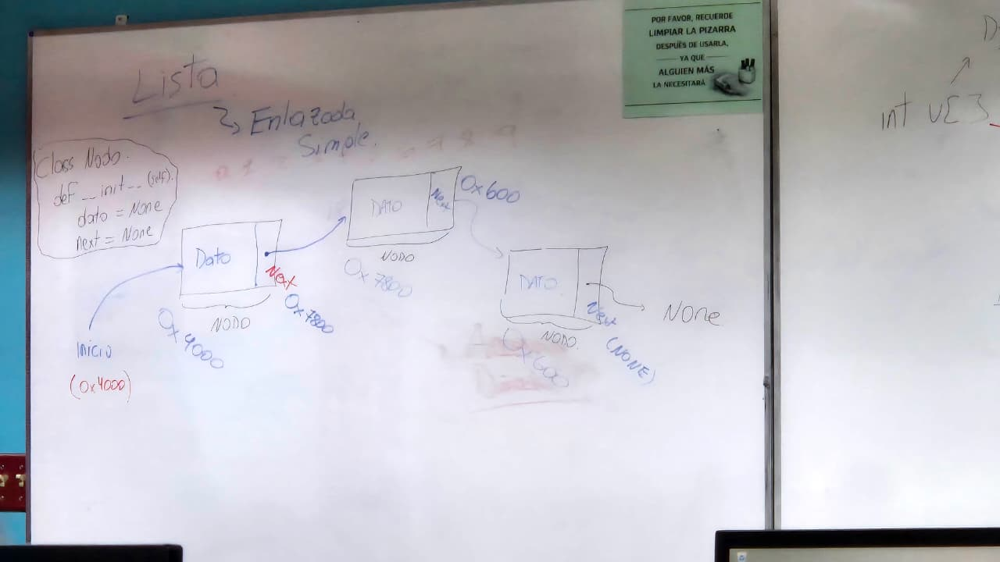
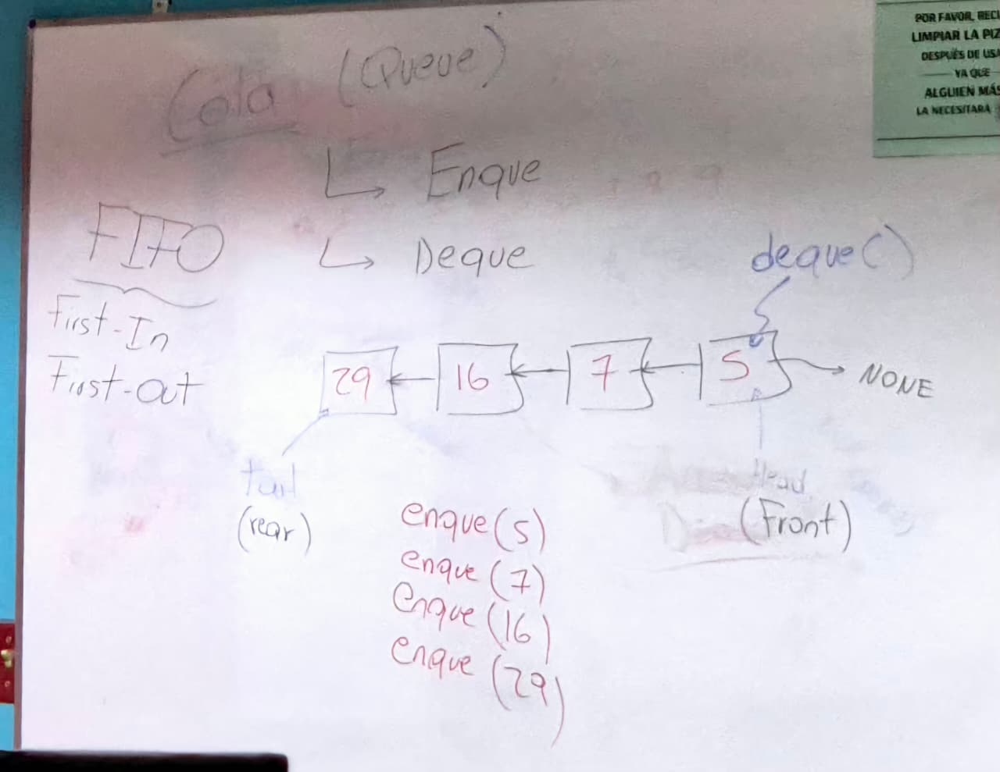
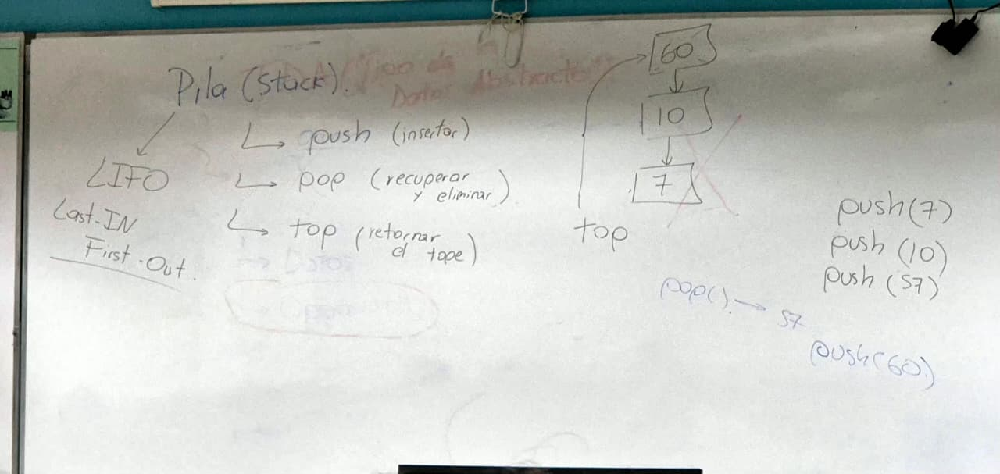

# TDA (Tipo de Datos Abstracto)


## Definición:


**Uso más eficiente de la memoria**


- Datos que se quieren guardar.
- Operaciones (Principal diferenciación de una estructura a otra)


### Características


- Ayudan a moderar que estructuras de datos utilizar para cada situación.
- Lo importante son las características que diferencian cada estructura de datos para conocer cuál es su implementación más eficiente


## Implementación:


No importa, debido a que está puede variar ya que se puede implementar una lista enlazada como vector u otros.


# Vector


``` {C++}
int v[10];
```


### Memoria Continua
|1|2|3|4|5|6|7|8|9|10
|:--:|:--:|:--:|:--:|:--:|:--:|:--:|:--:|:--:|:--:|
|ㅤ
|0x0000|0x0004|0x0008|0x0012|0x0016|0x0020|0x0024|0x0028|0x0032|0x0036|


A nivel de memoria RAM, lo que se dice es que reserve (Suponiendo arquitectura x86 64), es que reserve 4B por espacio de memoria, osea 40B.


- En el vector debe cumplir este requisito: La memoria asignada debe asignarse de manera continua.
- El vector debe saber cuanta memoria debe ser asignada para saber que tanto debe reservar.
- v  es un puntero, ya que &v[0] lo que retorna es la dirección de memoria del primer espacio reservado.


> v[4]=18; por debajo se transforma en *(v+4*int)


- Lo que significa: Ir a la dirección de v y moverse 4Byte por el tamaño de un int, osea moverse 16 Bytes y accede a 0x0016.
- Esto significa **Acceso Directo**, característica que tiene el vector. **Complejidad O(1)**, osea Constante.


## Ejemplo


### Automatico
``` {C++}
int v[5]; //En este caso C/C++ solo tiene este tamaño fijo y no se puede cambiar.
```


### Dynamic
``` {C++}
int v[];
```
|1|2|->|1|2|
|:--:|:--:|:--:|:--:|:--:|
| X |X
| Liberado | Liberado||Copy|Copy|


No hay garantia de que se pueda almacenar el espacio 2, ya que hay posibilidad de que este ocupado por otro elemento.


- Una opción para resolver este problema puede ser verificar si hay espacio, se puede hacer con la libreria ralloc.
- Entonces se busca otro espacio de memoria, se asigna los espacios de memoria, se copia lo previo en el nuevo espacio y luego se libera la memoria previamente utilizada. Llamado **Deep Copy**.
- Ineficiente porque necesita realizar el procedimiento varias veces cada vez que se necesita insertar elementos, provocando que vectores dinámicos extremadamente largos necesitan consuman mayor cantidad de memoria RAM y realicen mayor cantidad de procedimientos.


Un ejemplo de 1.000.000 de elementos realizan aproximadamente 500.000.000 operaciones al utilizar la fórmula de Gauss


Para evitar que esto deje de ser ineficiente, entonces se realiza una expansión x2 del tamaño original para en vez de hacer una operación por cada operación, sea entonces una cantidad menor, reducción la cantidad de 500.000.000 operaciones a solamente 2.000.000


### Operaciones
- Insertar
- Borrar
- Buscar



# Lista


## Lista Enlazada Simple


Difiere de un vector únicamente en como se asigna la memoria.


### Nodo


|Dato|Next|->|Dato|Next|->|Dato|Next|
|:--:|:--:|:--:|:--:|:--:|:--:|:--:|:--:|
|0x4000 (Nodo)| Next guarda 0x7800||0x7800 (Nodo)|Next guarda 0x0600||0x0600 (Nodo)|Next guarda None


Se tiene un inicio que apunta a la dirección de memoria 0x4000


``` {Python}
class Nodo:
    def __init__(self, dato=None, next=None):
        self.dato = dato
        self.next = next
}
```
### Operaciones
- Insertar
- Borrar
- Buscar




# Cola (Queue)


### Operaciones


- Enque
- Deque


||<-||<-||<-||->|None
|:--:|:--:|:--:|:--:|:--:|:--:|:--:|:--:|:--:|
|Tail (Rear)||||||Head (Front)||


## Enque


Inserta un elemento por tail, empujando el resto de elementos hacia el frente según se fueron insertando.


- enque(5)
- enque(7)
- enque(16)
- enque(29)


|29|<-|16|<-|7|<-|5|->|None
|:--:|:--:|:--:|:--:|:--:|:--:|:--:|:--:|:--:|
|Tail (Rear)||||||Head (Front)||


## Deque


deque() devuelve el resultado que apunta Head, simulando el efecto de un fila, eliminando el último elemento, o el primero en ser insertado.


#### FIFO


- First
- In
- First
- Out



# Pila (Stack)


### Operaciones


- push (insertar)
- pop (recuperar y eliminar)
- top (retornar el tope)


## push


top es un puntero que apunta al elemento de más arriba (o el último elemento ingresado). Se insertan los elementos y se van relacionando los elementos.


- push(7)
- push(10)
- push(57)


|57 <- TOP
|:--:|
|v
|10
|v
|7|


## pop


pop()


|10   <- TOP
|:--:|
|v
|7|


Retorna 57 y se elimina del stack, y a la vez top apunta a 10 al ser el último ingresasdo disponible.


Si se realiza otro push nuevamente de push(60), se inserta y sube de primero y top apuntaría a 60 en vez de 10.


push(60)


|60 <- TOP
|:--:|
|v
|10
|v
|7|

#### LIFO


- Last
- In
- First
- Out




### Las anteriores son llamadas estructuras de datos lineales


